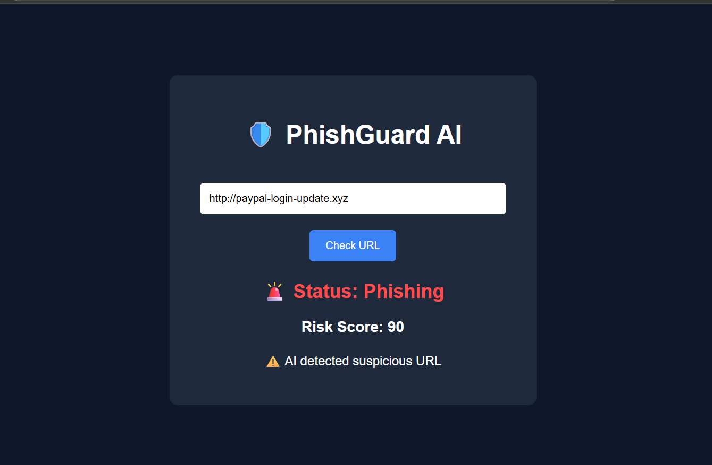

# 🛡️ PhishGuard AI

AI-Powered Phishing URL Detection System using FastAPI and Machine Learning.

## 🚀 Features

- Detect phishing URLs
- Machine Learning prediction
- FastAPI backend
- Beautiful frontend UI
- Real-time scanning
- Risk score analysis

## 🧠 Technologies Used

- Python
- FastAPI
- Scikit-learn
- HTML
- CSS
- JavaScript

## 📂 Project Structure

```bash
phishguard-ai/
│
├── backend/
├── frontend/
├── README.md
```

## ⚡ Installation

```bash
pip install -r requirements.txt
```

## ▶️ Run Backend

```bash
uvicorn app:app --reload
```

## 🖥️ Open Frontend

Open:

```bash
frontend/index.html
```

## 📸 Screenshots

## 📸 Screenshots



## 👨‍💻 Author

Mohamed Mujahith